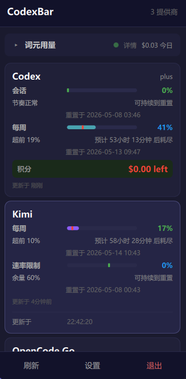
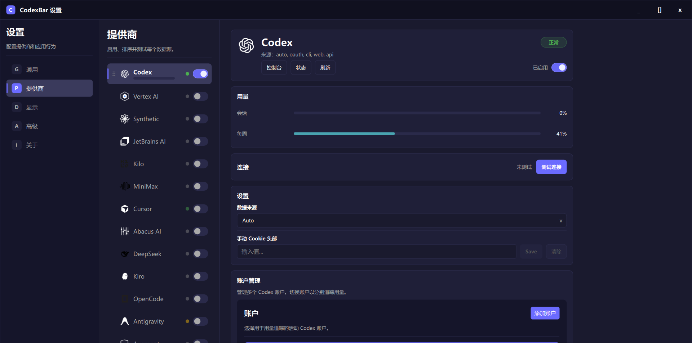

# WinCodexBar

[English](README_EN.md) | 简体中文

**WinCodexBar** 是一款 Windows 系统托盘工具，用于实时监控多个 AI 编程助手的用量、额度和重置时间。基于 C++ 和 Qt 6.5 开发，轻量高效，适合开发者长期常驻桌面使用。


---





---

## 功能特性

### 核心功能

- **实时用量监控** - 在系统托盘中显示今日、30 天、会话和每周的用量统计
- **多服务商支持** - 支持 30+ 主流 AI 编程助手服务商
- **额度追踪** - 显示剩余额度、进度条、预计耗尽时间
- **重置提醒** - 显示额度重置倒计时
- **连接状态** - 实时显示各服务商连接状态
- **深色主题** - 适配 Windows 深色模式，护眼美观
- **开机自启** - 支持开机自动启动

### 高级功能

- **多账号支持** - 部分服务商支持多账号切换
- **自动登录** - 自动读取浏览器 Cookie 或 CLI 配置
- **安全存储** - 凭据加密存储在 Windows Credential Manager
- **离线使用** - 便携版无需安装，解压即用

---

## 支持的 AI 服务商

WinCodexBar 支持以下 AI 编程助手服务商：

### 主流服务商

| 服务商 | 认证方式 | 功能支持 |
|--------|---------|---------|
| **OpenAI Codex** | OAuth / CLI | ✅ 额度、用量、重置时间 |
| **Claude** | API Key | ✅ 用量统计 |
| **GitHub Copilot** | OAuth | ✅ 订阅状态 |
| **Cursor** | Cookie | ✅ 额度、用量 |
| **Kimi** | Cookie / Token | ✅ 用量统计 |
| **DeepSeek** | API Key | ✅ 用量统计 |

### API 平台

| 平台 | 认证方式 | 功能支持 |
|------|---------|---------|
| **OpenRouter** | API Key | ✅ 用量、余额 |
| **z.ai** | Cookie | ✅ 额度、用量 |
| **Perplexity** | API Key | ✅ 用量统计 |
| **Mistral** | API Key | ✅ 用量统计 |
| **Together AI** | API Key | ✅ 用量统计 |

### 其他服务商

- **Google Gemini** - API Key
- **Google VertexAI** - Service Account
- **MiniMax** - API Key
- **Alibaba (通义千问)** - API Key
- **Ollama** - 本地服务
- **OpenCode** - 本地 SQLite
- **Augment** - Cookie
- **Amp** - Cookie
- **JetBrains AI** - Cookie
- **Factory** - API Key
- **Warp** - Cookie
- **Abacus** - Cookie
- **Codebuff** - Cookie
- **Windsurf** - SQLite
- **KimiK2** - Cookie
- **Kilo** - Cookie
- **Kiro** - Cookie
- **Antigravity** - Cookie

---

## 系统要求

### 运行环境

- **操作系统**: Windows 10 1809 或更新版本
- **运行时**: 无需额外依赖（所有依赖已打包）

### 开发环境（仅构建需要）

- **编译器**: Visual Studio 2022 或 Build Tools
- **Qt**: 6.5.3 或更新版本 (MSVC 2022 64-bit)
- **CMake**: 3.21 或更新版本
- **Git**: 用于克隆仓库

---

## 安装方法

### 方式一：下载安装包（推荐）

1. 前往 [Releases](https://github.com/basil520/WinCodexBar/releases) 页面
2. 下载最新版本的 `WinCodexBar-x.x.x-Installer.exe`
3. 运行安装程序，按提示完成安装
4. 安装完成后自动创建桌面快捷方式和开始菜单项

### 方式二：便携版

1. 下载 `WinCodexBar-x.x.x-portable.zip`
2. 解压到任意目录
3. 双击 `WinCodexBar.exe` 运行
4. 可创建桌面快捷方式方便使用

---

## 使用方法

### 首次运行

1. 启动 WinCodexBar，程序将最小化到系统托盘
2. 右键点击托盘图标，选择 **Settings**（设置）
3. 在 **Providers**（服务商）标签页中启用需要的服务商
4. 根据提示配置认证信息（API Key 或自动登录）

### 配置服务商

#### API Key 方式

1. 在设置中选择对应服务商
2. 点击 **Configure**（配置）
3. 输入 API Key
4. 点击 **Test**（测试）验证连接

#### 自动登录方式

部分服务商支持自动读取浏览器 Cookie 或 CLI 配置：

- **OpenAI Codex**: 自动读取 Codex CLI 配置或浏览器登录状态
- **Cursor**: 自动读取 Chrome/Edge Cookie
- **Kimi**: 自动读取 Chrome/Edge Cookie

### 查看用量

- 左键点击托盘图标，展开用量面板
- 显示今日用量、30天用量、会话用量等
- 进度条显示剩余额度百分比
- 悬停查看预计耗尽时间和重置时间

### 高级设置

- **自动刷新**: 设置自动刷新间隔（默认 5 分钟）
- **开机自启**: 设置开机自动启动
- **主题**: 切换深色/浅色主题
- **语言**: 支持中文和英文界面

---

## 从源码构建

### 克隆仓库

```powershell
git clone https://github.com/basil520/WinCodexBar.git
cd WinCodexBar
```

### 安装依赖

1. 安装 Visual Studio 2022 或 Build Tools
2. 安装 Qt 6.5.3 (MSVC 2022 64-bit)
3. 设置环境变量 `CMAKE_PREFIX_PATH` 指向 Qt 安装目录

```powershell
# 示例
$env:CMAKE_PREFIX_PATH = "C:\Qt\6.5.3\msvc2019_64"
```

### 构建

```powershell
# 配置项目
cmake -B build -DCMAKE_PREFIX_PATH=C:\Qt\6.5.3\msvc2019_64

# 构建
cmake --build build --config Release --parallel

# 运行
.\build\Release\WinCodexBar.exe
```

### 构建安装程序

```powershell
# 安装 Qt Installer Framework
# 下载地址: https://download.qt.io/official_releases/qt-installer-framework/

# 构建安装程序
.\Scripts\build-installer.ps1 -Version 0.1.0
```

---

## 测试

项目包含完整的单元测试套件：

```powershell
# 构建项目（包含测试）
cmake -B build -DBUILD_TESTS=ON

# 运行所有测试
ctest --test-dir build -C Release --output-on-failure

# 运行特定测试
ctest --test-dir build -C Release -R tst_RateWindow
```

---

## 项目结构

```
WinCodexBar/
├── src/                    # 源代码
│   ├── app/               # 应用核心逻辑
│   ├── providers/         # 服务商实现
│   ├── models/            # 数据模型
│   ├── network/           # 网络层
│   ├── tray/              # 托盘功能
│   └── util/              # 工具类
├── qml/                    # QML 界面
├── resources/              # 资源文件
├── translations/           # 翻译文件
├── tests/                  # 单元测试
├── installer/              # 安装程序配置
├── Scripts/                # 构建脚本
└── .github/workflows/      # GitHub Actions 配置
```

---

## 常见问题

### Q: 为什么看不到用量数据？

**A:** 请检查：
1. 服务商是否已启用
2. 认证信息是否正确
3. 网络连接是否正常
4. 点击刷新按钮手动刷新

### Q: 如何添加多个账号？

**A:** 部分服务商支持多账号：
1. 在设置中添加新的服务商实例
2. 配置不同的认证信息
3. 可以重命名区分不同账号

### Q: 数据存储在哪里？

**A:** 
- 配置文件: `%APPDATA%\CodexBar\`
- 凭据: Windows Credential Manager（加密存储）
- 日志: `%LOCALAPPDATA%\CodexBar\logs\`

### Q: 支持代理吗？

**A:** WinCodexBar 使用系统代理设置，会自动读取 Windows 代理配置。

---

## 贡献指南

欢迎贡献代码、报告问题或提出建议！

### 开发流程

1. Fork 本仓库
2. 创建功能分支 (`git checkout -b feature/amazing-feature`)
3. 提交更改 (`git commit -m 'feat: add amazing feature'`)
4. 推送到分支 (`git push origin feature/amazing-feature`)
5. 创建 Pull Request

### 代码规范

- 遵循 C++17 标准
- 使用 Qt 编码风格
- 添加单元测试
- 更新文档

---

## 项目来源

本项目基于 [CodexBar](https://github.com/steipete/CodexBar) 开发，进行了 Windows 平台适配和独立维护。

感谢原作者 [@steipete](https://github.com/steipete) 的开源贡献！

---

## 许可证

本项目采用 [MIT 许可证](LICENSE) 开源。

---

## 联系方式

- **问题反馈**: [GitHub Issues](https://github.com/basil520/WinCodexBar/issues)
- **功能建议**: [GitHub Discussions](https://github.com/basil520/WinCodexBar/discussions)

---

<p align="center">
  Made with ❤️ for AI developers
</p>
